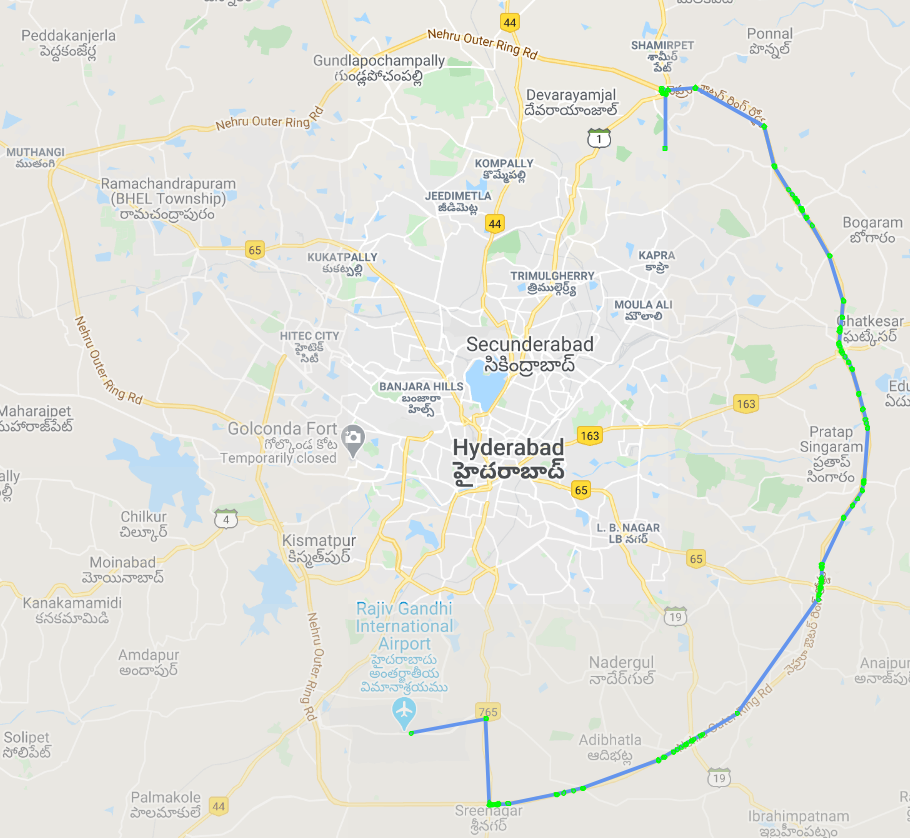

<br />
<p align="center">

  <h2 align="center">Optimal Map Routing</h2>

  <p align="center">
    Calculate optimal path between 2 locations on Map using A-Star path finding algorithm.
    <br />
  </p>
</p>


## Table of Contents

- [Table of Contents](#table-of-contents)
- [About The Project](#about-the-project)
- [Getting Started](#getting-started)
  - [Prerequisites](#prerequisites)
  - [Dependencies](#dependencies)
  - [Installation](#installation)
- [Project Layout](#project-layout)
- [License](#license)
- [Project Contributors](#project-contributors)


## About The Project



This repo contains the code for the implementation of the A-Star Best-first-search algorithm.
This algorithm calculates the optimal route present between 2 locations (BITS Hyderabad and 
RGIA Airport in this example) and shows them on map using google maps API.

The algorithm is made independant from the map code so that others can find it easily if required.
This Code uses a running Postgres database instance which has a map of Hyderabad (fetched from 
[here](https://www.interline.io/osm/extracts/)) from which all roads are fetched. 

## Getting Started

This repo provides 2 files to calculate the distance matrix. The first file `calcDist.py` uses 
the data from the osm database to get road distances. There is also another file `getDist.py`
which uses the Bing Maps server to calculate the distances between nodes(API key required).

### Prerequisites

To run this project, we need a postgres database with postgis installed. There are many articles 
on google which can be used to setup postgres with gis support.

Load the file present in `datasets/hyderabad_india.osm.pbf` with osm2pgsql tool to postgis database

Create a file in `src` folder with name `APIKeys.json` to store all your API keys (for bing and google maps).
These can be freely created. Bing Maps in optional, but Google Maps is required to draw path on map. In case 
if you do not want to create any keys, the path is still stored in csv file `src/FinalPath.csv` with the 
optimal path which can be used for other purposes.

```json
{
    "BingMapsKey": "Your-Bing-Maps-Key-Here",
    "GoogleMapsKey": "Your-Google-Maps-Key-Here"
}
```

### Dependencies

This is an list of dependencies present/used in the project. If not present, 
use conda/pip to install the necessary.

- json
- heapq
- pickle
- gmplot
- pandas
- pickle
- numpy
- psycopg2
- tqdm

### Installation
 
1. Clone the repo
```sh
git clone https://github.com/RikilG/Optimal-Map-Routing.git
cd Optimal-Map-Routing/src
```
2. Start your postgres server if it is not running
3. Generate the Distancce Matrix
```sh
python calcDist.py
```
4. Run A-Star algorithm and display result
```sh
python AStar.py
```

## Project Layout

Repo folder structure
```sh
Repo Root
├── datasets
│   └── hyderabad_india.osm.pbf
├── images
│   └── route.png
├── src
│   ├── other
│   │   ├── roads_sql_queries.txt
│   │   └── wardNames.txt
│   ├── APIkeys.json
│   ├── AStar.py
│   ├── calcDist.py
│   ├── getDist.py
│   └── point.py
├── LICENSE
└── README.md
```

## License

Distributed under the MIT License. See `LICENSE` for more information.

## Project Contributors

- [Rikil Gajarla](https://github.com/RikilG)
- [Naga Sai Bharath](https://github.com/nagasaibharath)
- [Akash Bonagiri](https://github.com/akashalien)

Project Link: [https://github.com/RikilG/Optimal-Map-Routing](https://github.com/RikilG/Optimal-Map-Routing)
